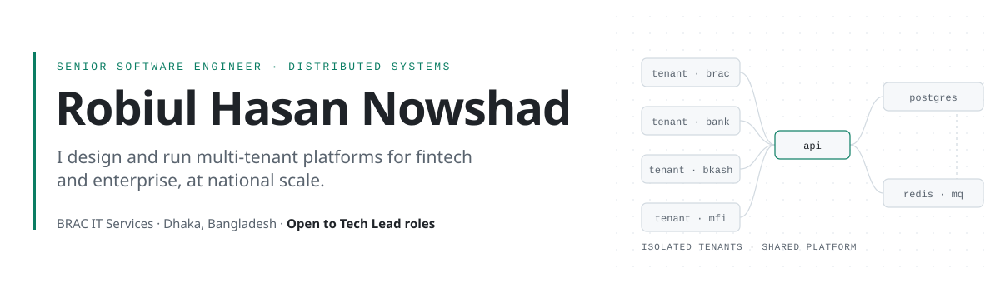
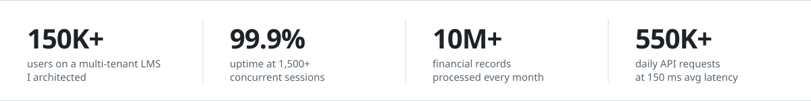

<picture>
  <source media="(prefers-color-scheme: dark)" srcset="assets/header-dark.svg">
  
</picture>

  <a href="https://www.linkedin.com/in/rh-nowshad/"><b>LinkedIn</b></a>&nbsp;&nbsp;·&nbsp;&nbsp;
  <a href="mailto:nowshad21aug@gmail.com"><b>Email</b></a>&nbsp;&nbsp;·&nbsp;&nbsp;
  <a href="https://leetcode.com/u/rh-nowshad/"><b>LeetCode</b></a>&nbsp;&nbsp;·&nbsp;&nbsp;
  <a href="https://certificate.algoexpert.io/AE-e366f4cc8a"><b>AlgoExpert</b></a>

I'm a backend-focused engineer with 5+ years of building systems where failure is expensive: banking, payments, and enterprise platforms used by some of Bangladesh's largest organizations.

Today I'm the architect of **WeLearn**, a multi-tenant learning platform serving **150K+ users** across BRAC, BRAC Bank, bKash and BRAC Microfinance. My day-to-day work is in the internals: tenant isolation, queue and scheduler design, query and cache performance. I also lead the people around the system. I mentor engineers, set the review bar, and take ownership from architecture through production.

 

<picture>
  <source media="(prefers-color-scheme: dark)" srcset="assets/impact-dark.svg">
  
</picture>

## Selected work

#### WeLearn: Enterprise Learning Platform
`Symfony` `Angular` `PostgreSQL` `Docker` · BRAC IT · 2025

One platform, several organizations that can never see each other's data. I designed the multi-tenancy model, with data isolation for each organization, and defined the module boundaries. I also lead the team that builds on top of it. The platform runs at **1,500+ concurrent sessions with 99.9% uptime**.

#### Report Engine: Shared Reporting Service
`Symfony` `Angular` `PostgreSQL` `RabbitMQ` · BRAC IT · 2025

A single service that generates reports from multiple data sources, with configurable formats, access control and filtering. It is **adopted across BRAC IT projects** and has reduced manual reporting effort. I delivered core feature modules and performance improvements.

#### Cloud Billing Automation
BRAC IT · 2025

Automated billing across multiple entities, now processing **$50K+ every month**. It **cut reconciliation time by 60%** and eliminated billing discrepancies.

#### ROI Analytics Platform: British American Tobacco
`Laravel` `React` `Oracle` `Azure` `Redis` · SSL Wireless · 2024

ETL pipelines and an analytics layer over **10M+ financial records a month**, with sub-second queries for revenue, expense and investment ROI. It replaced **100+ manual weekly reports**, saving **200+ hours** of analyst time.

#### Sales Force Automation: Easy SR
`Laravel` `React` `Oracle` · SSL Wireless · 2024

Distributed microservices behind an offline-first mobile app for **2,000+ field reps**. It handles **550K+ API requests a day at 150 ms average latency**.

#### Pickaboo: E-commerce Marketplace
`Magento 2` `Elasticsearch` `Azure` `Redis` · Dcastalia · 2022

I led backend development for a high-traffic marketplace with **100K+ monthly transactions** and a seller portal for **200+ vendors** with real-time inventory sync. I tuned catalog search over 50K+ SKUs, bringing **page load from 3.2 s to 0.8 s**.

Also at Dcastalia, I architected a multi-gateway payment system across **5+ providers** (including BRAC Bank and Nagad), running at a **99.8% payment success rate**.

## Leadership

- **Architecture ownership:** I make the structural decisions on a platform used by 150K+ people, and I'm accountable for them in production.
- **Raising the team's bar:** I mentor 5 engineers and wrote the code review standard my team works to. I've trained and reviewed junior engineers at every company I've been part of.
- **Delivery systems, not just features:** I introduced automated testing at 80%+ coverage, which cut production bugs by 60% and deploy time from 4 hours to 30 minutes.
- **Reliability as a habit:** I held a 99.95% SLA on Azure + Oracle integrations and introduced ELK observability that cut MTTR by 70%.
- **Business-aware trade-offs:** I measure success in reconciliation hours saved, SLAs held and reports nobody has to build by hand any more.

## Experience

| Period | Company | Role |
|:--|:--|:--|
| 2025 – present | **BRAC IT Services Ltd.** | Senior Software Engineer |
| 2023 – 2025 | **Software Shop Ltd. (SSL Wireless)** | Software Specialist |
| 2021 – 2023 | **Dcastalia Ltd.** | Junior Software Engineer → Software Engineer |

B.Sc. in Computer Science & Engineering, Ahsanullah University of Science and Technology (2016 – 2020)

## Toolkit

| | |
|:--|:--|
| **Languages** | PHP · TypeScript · Python |
| **Frameworks** | Symfony · Laravel · Angular · React · Node.js · Magento 2 |
| **Data** | PostgreSQL · MySQL · Oracle · SQL Server · Redis · Elasticsearch · RabbitMQ |
| **Platform** | Azure · GCP · Docker · Kubernetes · CI/CD · Linux · ELK |
| **Architecture** | Multi-tenant SaaS · Microservices · Event-driven systems · REST API design · Caching · Horizontal scaling |
| **AI engineering** | LLM application design · Bangla speech-to-signal pipelines · Natural-language querying over datasets |
| **Agentic tooling** | Claude Code · GitHub Copilot · OpenAI Codex · Cursor · Google Antigravity |

**Certifications:** Symfony Messenger (SymfonyCasts) · Claude Code in Action (Anthropic) · [AlgoExpert](https://certificate.algoexpert.io/AE-e366f4cc8a)

## Get in touch

Most of my production work lives in private enterprise repositories. I'm glad to walk through the architecture, trade-offs and lessons in a conversation.

I'm currently open to **Tech Lead** and **Senior Engineer** roles, on-site or remote.
→ [linkedin.com/in/rh-nowshad](https://www.linkedin.com/in/rh-nowshad/) · [nowshad21aug@gmail.com](mailto:nowshad21aug@gmail.com)
